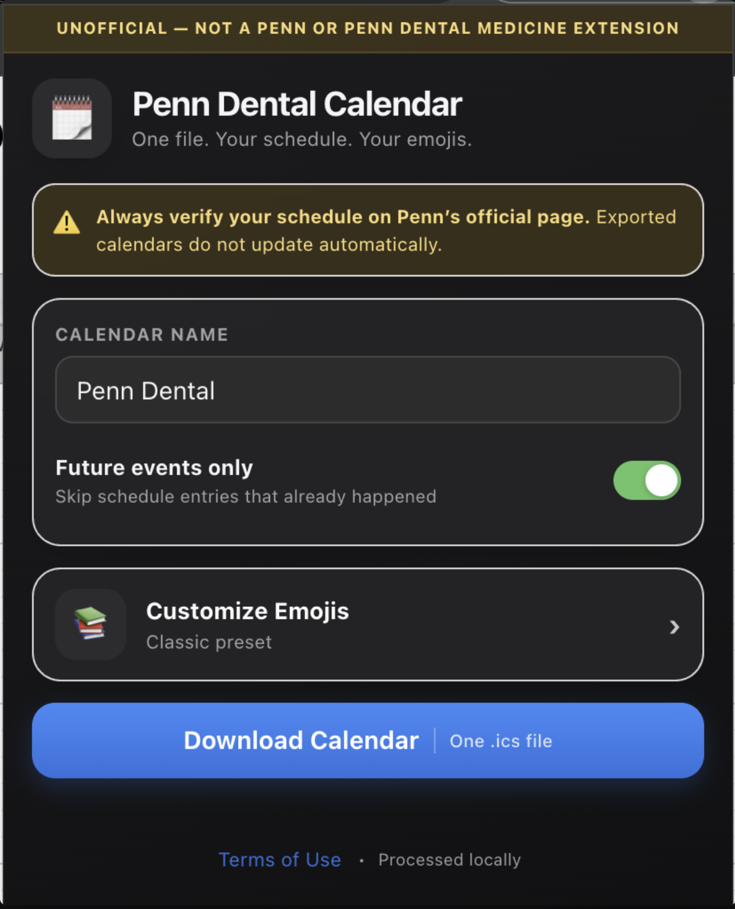

<div align="center">

# 🗓️ Penn Dental Calendar
### Custom Emoji Edition

**One file. Your schedule. Your emojis.**


</div>

> **⚠️ Unofficial student tool — not affiliated with, endorsed by, or produced by the University of Pennsylvania or Penn Dental Medicine.**

A Chrome extension that exports the currently signed-in student's Penn Dental schedule as a single calendar file (`.ics`), with custom emoji icons for every event type. All processing happens locally in your browser — nothing is ever sent to a server.

A companion landing page with the same instructions is available via `index.html` (GitHub Pages).

<p align="center">
  
</p>

---

## Contents

- [Privacy](#privacy)
- [Installation (start to finish)](#installation-start-to-finish)
- [How to use it](#how-to-use-it)
- [Importing into Google Calendar](#importing-into-google-calendar-recommended-use-a-separate-calendar)
- [Importing into other calendar apps](#importing-into-other-calendar-apps)
- [Disclaimer](#disclaimer)
- [Project structure](#project-structure)

---

## Privacy

All schedule processing occurs locally in the browser. The extension does not require your Penn password, and no schedule data or credentials are ever sent to an outside server.

## Installation (start to finish)

Chrome extensions installed this way aren't on the Chrome Web Store, so setup is done manually through Developer Mode. It takes about a minute.

1. **Download this repository.** On this repo's GitHub page, click the green **Code** button → **Download ZIP**.
2. **Unzip the file** on your computer (double-click it, or right-click → Extract All on Windows).
3. **Open Chrome** and go to `chrome://extensions` in the address bar.
4. **Turn on Developer mode** using the toggle in the top-right corner of the page.
5. Click **Load unpacked**.
6. In the file picker, select the `extension` folder from the files you unzipped (select the folder itself, not a file inside it).
7. The extension icon will now appear in your Chrome toolbar. You may need to click the puzzle-piece icon and pin it for easy access.

## How to use it

1. Log in and open your Penn Dental schedule page.
2. Click the extension icon in your Chrome toolbar.
3. The first time you use it, you'll see the **Terms of Use** — read it, check the box, and click **Accept and Continue**.
4. In the popup:
   - Set a **calendar name** (defaults to "Penn Dental") — import into a calendar with this name, not your main calendar.
   - Toggle **Future events only** if you want to skip events that already happened.
   - Under **Reminders**, choose how many minutes before every event you want an alert (default 10), and whether exams and quizzes get an extra earlier heads-up (default 7 days before). Turn either switch off if you don't want that reminder at all.
   - Tap **Customize Emojis** to open the emoji editor page.
5. On the emoji editor page:
   - Pick one of the five presets across the top: **Classic**, **Academic**, **Minimal**, **Dental**, or **No Emoji** (which turns off icons entirely and uses Penn's original titles).
   - To fine-tune an individual event type, tap its icon to open the picker — choose any emoji from the grid with one tap (no typing).
   - Tap the ↺ icon next to a row to reset just that type, or **Reset** at the top to reset everything to Classic.
   - Toggle **Add QUIZ: / EXAM: text tags** if you want a plain-text tag before those titles, alongside (or instead of) the emoji.
   - Tap **‹** to go back to the main screen.
6. Click **Download Calendar** to save the `.ics` file.

## Importing into Google Calendar (recommended: use a separate calendar)

**Don't import directly into your main calendar.** Google Calendar import adds every event to whichever calendar you select, and there's no easy "undo" for hundreds of imported events. Creating a dedicated calendar first means you can hide, edit, or delete your entire Penn Dental schedule in one click without touching anything else on your main calendar.

1. Go to [calendar.google.com](https://calendar.google.com).
2. On the left sidebar, next to **Other calendars**, click the **+** icon → **Create new calendar**.
3. Name it the same as the extension's default (e.g. `Penn Dental`) so it's easy to recognize, then click **Create calendar**.
4. Click the ⚙︎ **Settings** gear icon (top right) → **Import & Export**.
5. Under **Import**, click **Select file from your computer** and choose the `.ics` file you downloaded from the extension.
6. Under **Add to calendar**, select the new calendar you just created — **not** your main/default calendar.
7. Click **Import**. Google will confirm how many events were added.
8. Your Penn Dental schedule now lives in its own calendar, which you can show/hide from the sidebar checkbox at any time, independent of your personal events.

To re-import later (e.g. after a schedule change), repeat the same steps — or delete the calendar and recreate it if you want a clean slate.

## Importing into other calendar apps

- **Apple Calendar:** File → Import, select the file, and when prompted choose (or create) a calendar other than your default one.
- **Outlook:** File → Open & Export → Import/Export → Import an iCalendar file, and assign it to a new or secondary calendar rather than your primary one.

Always double-check your imported calendar against Penn Dental's official schedule page — exported events do not update automatically.

## Disclaimer

This is an independent, unofficial student-created extension. It is not produced, sponsored, or maintained by the University of Pennsylvania or Penn Dental Medicine. Exported calendars are a personal convenience only and are not the official schedule — schedules may be added, removed, corrected, or rescheduled after export. You are responsible for verifying your schedule on Penn Dental's official page before every class, exam, quiz, lab, or seminar.

## Project structure

```
.
├── index.html                 # GitHub Pages landing page with install instructions
├── PUBLISHING-GUIDE.md        # Guide for publishing this repo to GitHub Pages
├── README.md                  # This file
└── extension/                 # The Chrome extension itself
    ├── manifest.json
    ├── popup.html / popup.css / popup.js
    ├── content.js
    ├── icons/
    └── screenshots/            # Screenshots used in this README
```

<div align="center">

—

Made by a Penn Dental student, for Penn Dental students. Not affiliated with Penn or Penn Dental Medicine.

</div>
